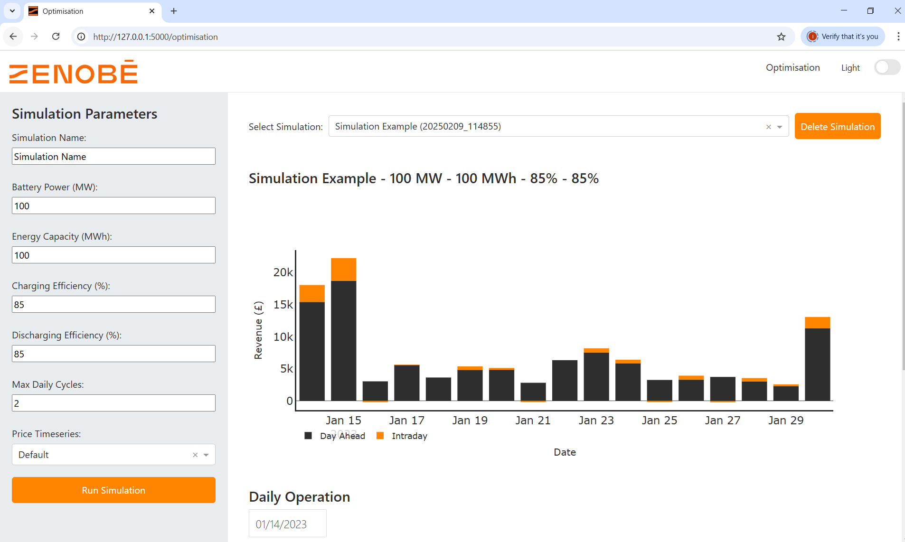

## Answers

### Question 1
To run locally (windows,assuming you have python and poetry installed), you can use the following commands:

```bash
python -m venv .venv
.venv\Scripts\Activate.ps1
poetry install
python app.py
```

To run the docker container, you can use the following commands:

```bash
docker build -t zenobe-dashboard -f Dockerfile .
docker run -p 8050:8050 zenobe-dashboard
```

Other useful commands:

```bash
# List running containers
docker ps

# Stop the container
docker stop zenobe-dashboard

# Remove the container
docker rm zenobe-dashboard

# List all images
docker images

# Remove the image
docker rmi zenobe-dashboard
```
Expected output from optimisation: 


Screenshot of dashboard:



### Question 2
Your solution is now ready to be cloud deployed. Can you outline, with specific references to products and solutions for existing cloud providers of your choosing, how you would structure your deployment given the following requirements:

Personally, I have recent positive experience with Digital Ocean, so I would elect to use their cloud platform. I've also had previous experience with AWS, so I would be comfortable using their platform too, with the added benefit that their RDS service could be used to store the operational data.

For Digital Ocean deployment, the steps would be the following:
1. Set up a droplet. 
2. Enter droplet, install docker.
```bash
# SSH into your droplet
ssh root@DROPLET_IP

# Create a new user
sudo adduser deployer

# Grant sudo privileges:
sudo usermod -aG sudo deployer
``` 
3. 
2. Retrieve the SSH key from the Digital Ocean dashboard.


* You receive a daily email with the input prices for the previous day
Flask has a built in mail service (FlaskMail). It's incredibly easy to set up and use, and I've used it in the past (for my friends football shirt selling website I made during COVID!). At high level the setup is as follows:
1. Set up a mail service in the cloud provider (Gmail works well). I'd recommend using a Gmail account that is offers no other service other than to preform this task. 
2. Turn off 2FA or use an app password.
3. Set up FlaskMail to use the mail service. Passing the email address, password, smtp server and port.
4. Set up a cron job to run the mail handler after the input prices are received. Or alternatively, set up a webhook to trigger the email handler. 
5. The email handler can attach the input prices to the email and I've had positive experiences with using email templates in the past. They effectively allow you to build a nice looking email by providing the html (which can get very complex!).

* The model should provide results with all latest available data when it is run
Please see

* Only a subset of company users should be able to access and run your solution
Flask has a built in authentication service (FlaskLogin). You can use this to restrict access, typically this is used for admin purposes but can also be extended to allow only certain users to access the solution. At a high level, you'd create an indicator variable in the user database, flagging whether the user has access to certain features. 

* You want to keep a database of existing runs so that previous runs can be queried and viewed rather than resubmitted
Similar to above, each run can be stored in a database, you can then query the database to get the results of previous runs. 
To implement this, I would create 3 databases:
1. A database to store the model run parameters, primary key is the run id.
2. A database to store the model run results, where the foreign key is the run id.
3. A database to store the user data, primary key is the user id.

```sql
run_parameters:
    run_id: int (PK)
    user_id: float
    user_group: float
    time_created: timestamp
    power_capacity: float
    ...

run_results:
    id: int (PK)
    run_id: int (FK)
    export_grid_da: float
    ...

user_data:
    id: int (PK)
    user_id: int (FK)
    user_group: varchar(255)
```

### Question 3
What are the most critical factors you would need to consider in a continuous deployment pipeline, ensuring consistent uptime for your solution?
1. Canary realses: deploying a small version of the app to a limited audience (i.e. within the team)
2. Blue green deployment: effectively switching between the two versions of a new and old app if the new version is not working as expected. 
3. Unit test: Testing each unit of code in isolation.

### Question 4
* What database would you use for large volumes of sensitive operational data?
PostgresSQL is a good choice, since: 
1. It's open source, so it's free.
2. It's a relational database, so it's easy to query.
3. It is popular, so there is large community support, docummentation and it is easy to integrate.
4. Due its popularity, it is easy to host on a cloud provider.
5. It has strict security features, such as: 
    * Encryption at rest (encryption of the database when it is not in use)
    * Encryption in transit (encryption of the data as it is sent between the client and server)
    * Being able to restrict access to the database, by only allowing certain servers (IP addresses) to access the database.

* Can you write an instance of a query for such database that joins the operational data to the timeseries output by the model on a per-timestamp basis?
```sql
optimisation_output:
    timestamp: datetime
    export_grid_da: float
    import_grid_da: float
    export_grid_intra_day: float
    import_grid_intra_day: float

operational_data:
    timestamp: datetime
    physical_notification: float
```
```sql
SELECT 
    opt.timestamp,
    o.physical_notification,
    opt.export_grid_da,
    opt.import_grid_da,
    opt.export_grid_intra_day,
    opt.import_grid_intra_day,
    CASE 
        WHEN o.physical_notification IS NULL THEN 'Missing operational data'
        ELSE 'Complete'
    END as data_status
FROM 
    optimisation_output opt
    LEFT JOIN operational_data o 
    ON opt.timestamp = o.timestamp;
    ```
* What possible issues would you look out for in joining the data?
1. The data may not be in the same timezone, so we would need to convert the data to the same timezone (make it timezone naive). Infact, this is a requirement of PostgreSQL.
2.DST! If converting to timezone naive, we may need to account for DST via a flag. Or we can drop one hour of data. Interested to hear your thoughts on this as it has been a recurring issue for me in the past. 
